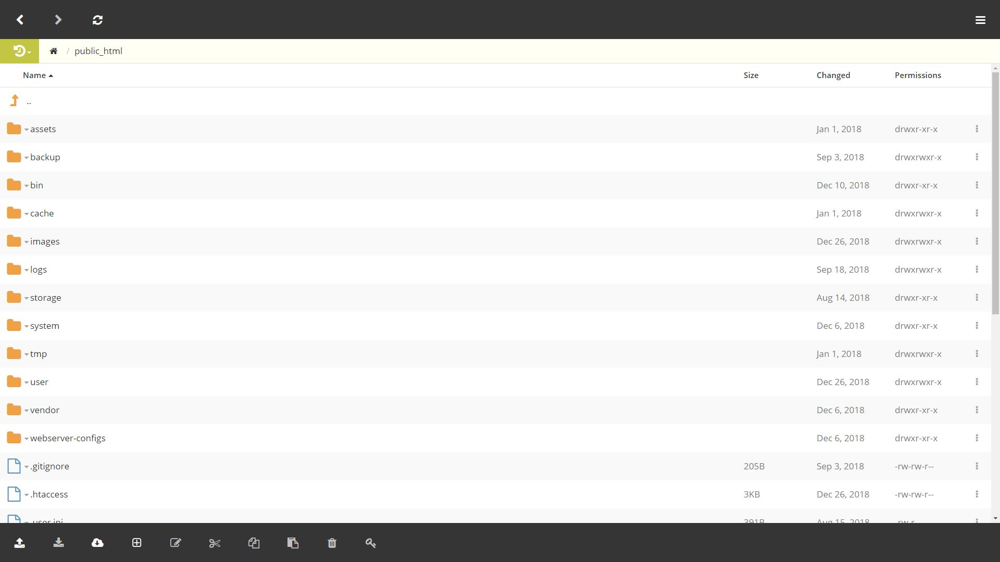

### Simple yet effective
We had a "file manager" solution lying around our office, being used only internally by our devs so we decided to 
"polish" it and include it in all our packages. We hope you'll find it usefull as our devs are. It is ofc not ment as a ftp file manager
replacement but more for those times when you need to do something quick but you don't have access to the source files. 
If you know how to SSH, always SSH! :)

### Responsive
Looks great on mobile devices, that's why it is usefull.

### User Interface
At the bottom of the screeen is your toolbar with "usual suspects" as upload, download, edit, delete. We also added
CHMOD. You're welcome :)

