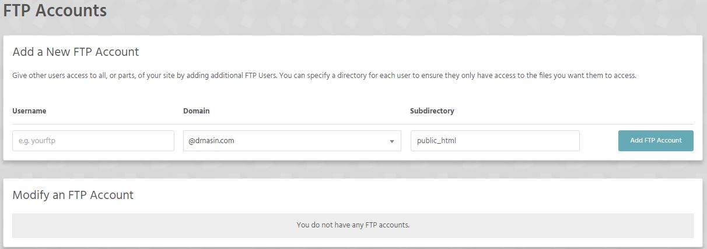

! This feature heavily depends on your account limits set by your hosting package. 

If your account allows only ONE ftp account then we are talking about your **main FTP account** (check your welcome email you received from us). You can also find information about your main ftp account in FTP Details section of your Stack Cockpit main screen. 

