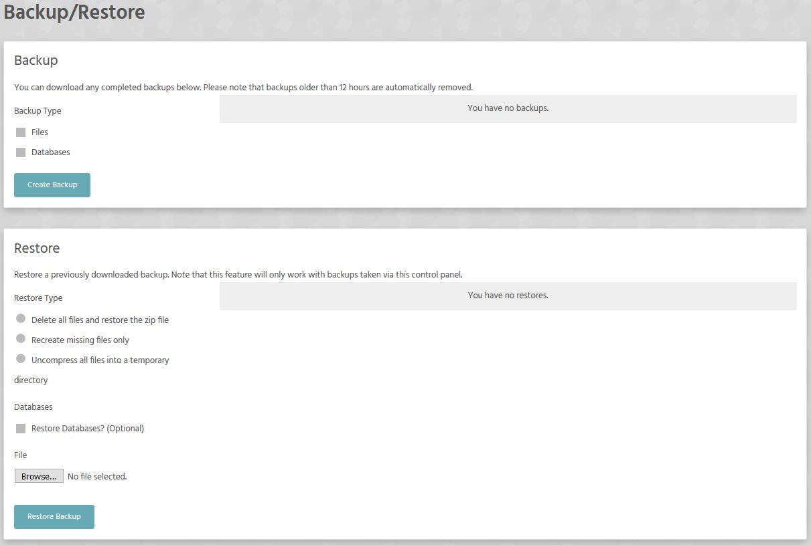

This section is reserved for backing up (and restoring) your site and database(s).
This image is pretty much self-explanatory.

! To backup your database don't forget to check the **Dabatases** checbox

