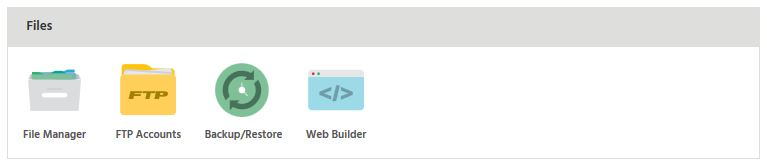

Files section of **Stack Cockpit** is your main entry point for anything "files" related.
Here you can add/edit/delete FTP accounts. We included for you a simple (yet effective) Files Manager for when you need to edit
a file "on the fly"

Here is the section breakdown item by item.
[ui-callout]
[ui-callout-item title="File Manager" position="42%, 9%, sw"]
Simple yet effective File Manager for those quick "on the fly" edits or uploads.
[/ui-callout-item]

[ui-callout-item title="FTP Accounts" position="42%, 23%, sw"]
Create/edit/delete FTP Accounts. _Account limits apply_.
! FTP Accounts are locked by default
[/ui-callout-item]

[ui-callout-item title="Backup / Restore" position="42%, 35%, sw"]
Backup restore your files and database(s) here.
[/ui-callout-item]

[ui-callout-item title="Web Builder" position="42%, 47%, sw"]
This is our go to tools for quick (usually personal) projects. Although we know that (we)
developers are not fond of tools like that, trust us, you will use it. Give it a chance.
[/ui-callout-item]

[/ui-callout]