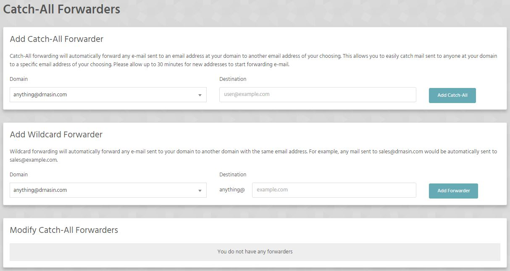

Catch-All forwarding will automatically forward any e-mail sent to an email address at your domain to another email address of your choosing. This allows you to easily catch mail sent to anyone at your domain to a specific email address of your choosing. 

!!! Please allow up to 30 minutes for new addresses to start forwarding e-mail.

