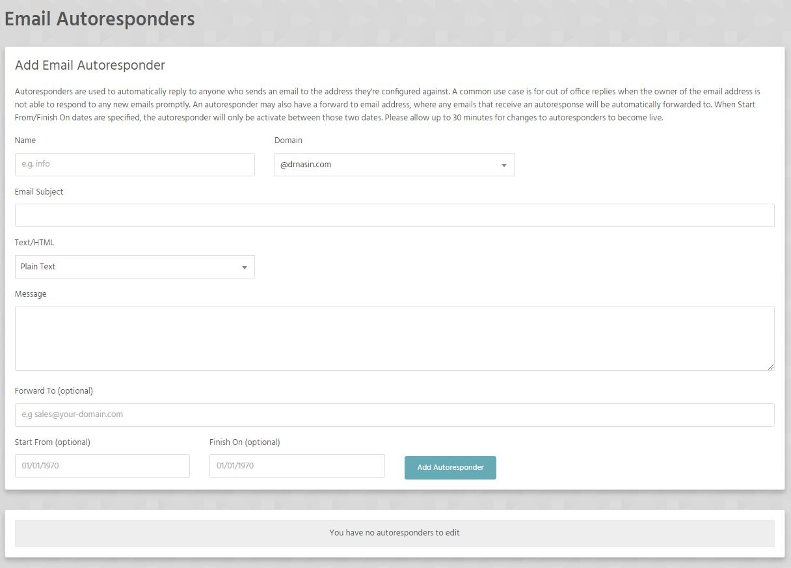

Autoresponders are used to automatically reply to anyone who sends an email to the address they're configured against. A common use case is for out of office replies when the owner of the email address is not able to respond to any new emails promptly. An autoresponder may also have a forward to email address, where any emails that receive an autoresponse will be automatically forwarded to. When Start From/Finish On dates are specified, the autoresponder will only be activate between those two dates. 

!!! Please allow up to 30 minutes for changes to autoresponders to become live.

