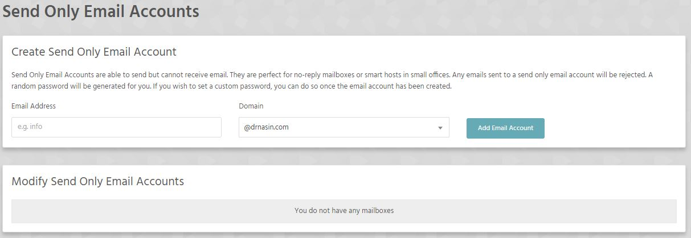
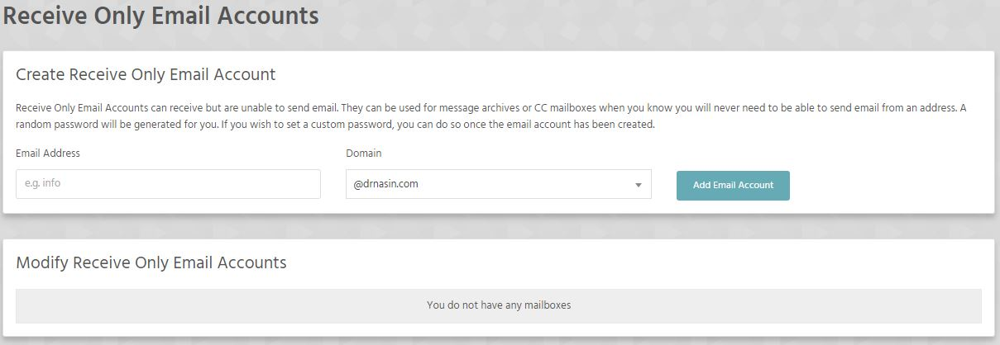

### Send Only Email Accounts

Send Only Email Accounts are able to send but cannot receive email. They are perfect for no-reply mailboxes or smart hosts in small offices. Any emails sent to a send only email account will be rejected. A random password will be generated for you. If you wish to set a custom password, you can do so once the email account has been created.

### Receive Only Email Accounts
Receive Only Email Accounts can receive but are unable to send email. They can be used for message archives or CC mailboxes when you know you will never need to be able to send email from an address. A random password will be generated for you. If you wish to set a custom password, you can do so once the email account has been created.

