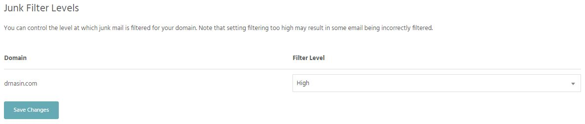
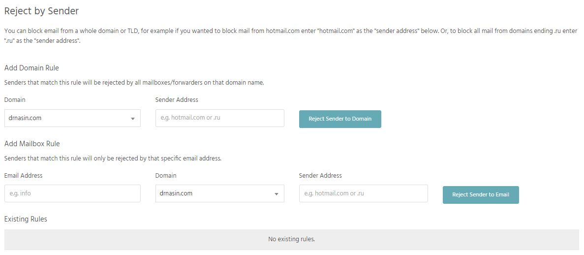
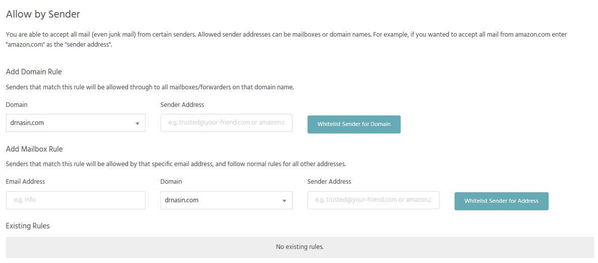

### Junk filter level
Junk mail filtering strips out any messages containing spam or viruses before you receive it and is enabled by default on all mailboxes we host. Messages containing a virus are automatically rejected and messages classified as spam will be placed into the "Junk" folder for that mailbox.

### Reject by Sender
You can block email from a whole domain or TLD, for example if you wanted to block mail from hotmail.com enter "hotmail.com" as the "sender address" below. Or, to block all mail from domains ending .ru enter ".ru" as the "sender address".

### Allow by Sender
You are able to accept all mail (even junk mail) from certain senders. Allowed sender addresses can be mailboxes or domain names. For example, if you wanted to accept all mail from amazon.com enter "amazon.com" as the "sender address".

