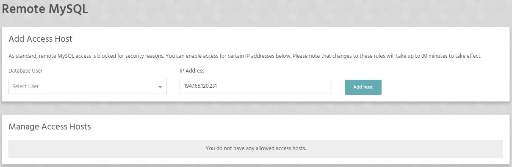
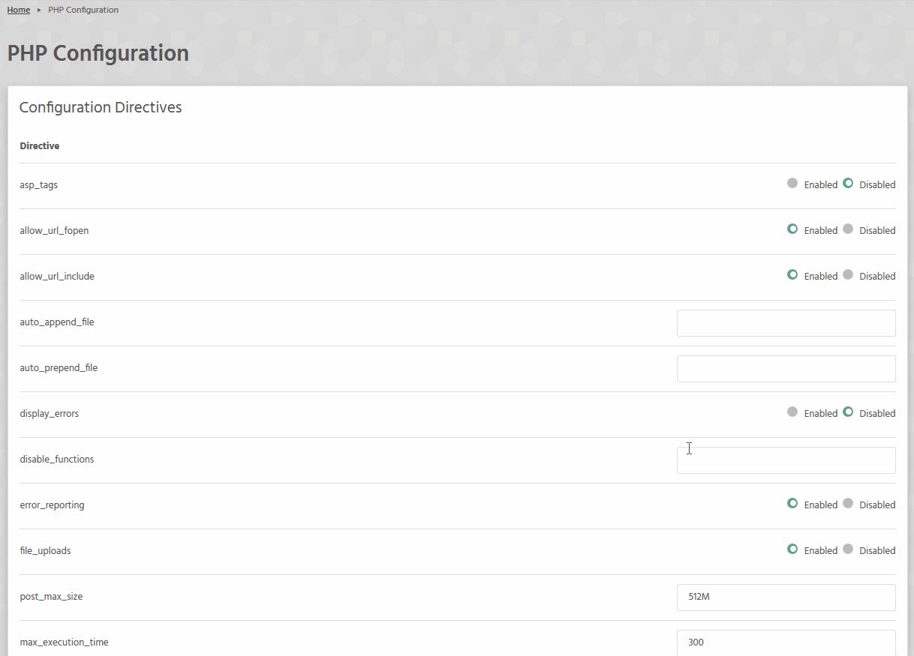
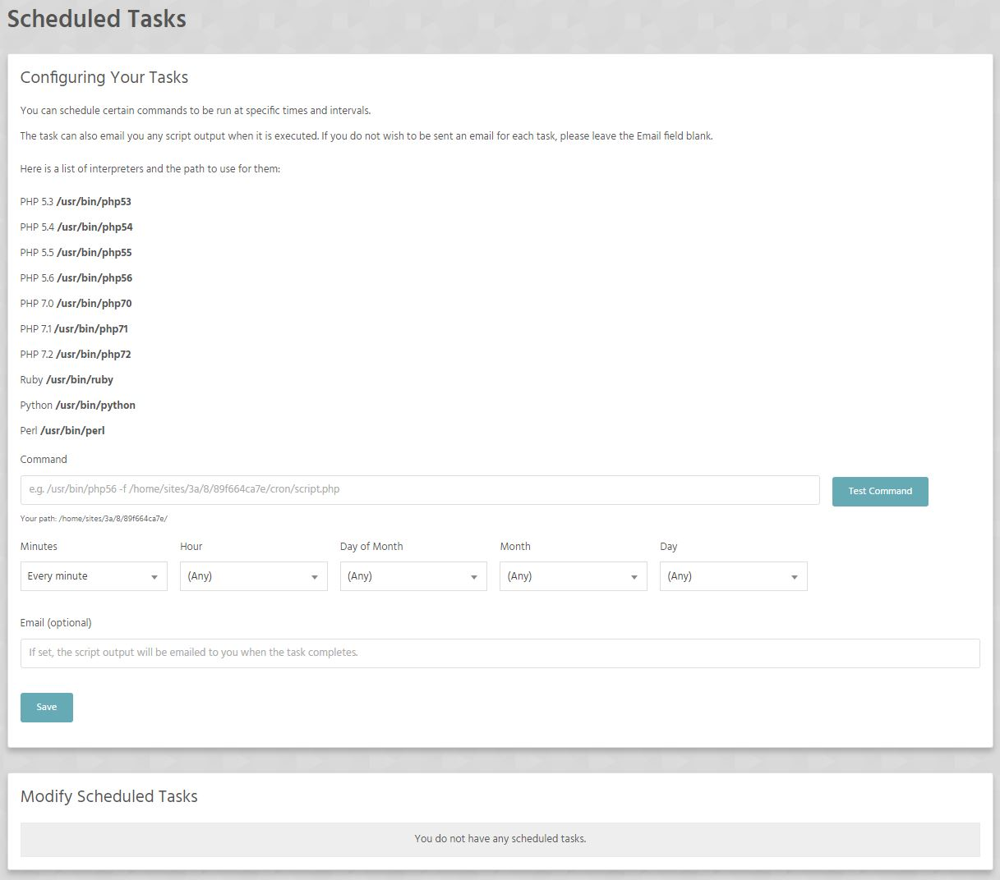
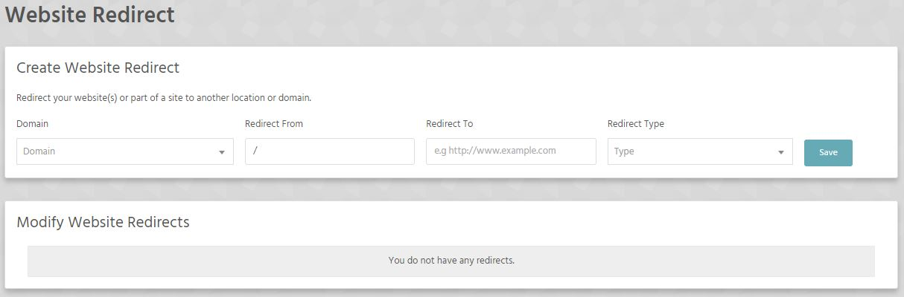

Web Tools section of the Stack Cockpit enables you to configure databases, switch and configure PHP version, set up cron jobs and domain redirects.

[ui-callout]

[ui-callout-item title="phpMyAdmin" position="40%, 8%, sw"]
Access phpMyAdmin and modify your database.
[/ui-callout-item]

[ui-callout-item title="MySQL Databases" position="40%, 22%, sw"]
Create and configure your database(s) here.
[/ui-callout-item]

[ui-callout-item title="Remote MySQL" position="40%, 34%, sw"]
Configure remote access to your mysql database.
[/ui-callout-item]

[ui-callout-item title="Change PHP Version" position="40%, 45%, sw"]
Change current running PHP version. We do our best to bring you the latest "stable" version the moment it is released.
[/ui-callout-item]

[ui-callout-item title="Configure PHP Version" position="40%, 58%, sw"]
Configure the current running PHP version.
[/ui-callout-item]

[ui-callout-item title="Scheduled Tasks / Cron jobs" position="40%, 70%, sw"]
Set up scheduled tasks ("cron jobs").
[/ui-callout-item]

[ui-callout-item title="Domain redirects" position="40%, 82%, sw"]
Set up redirects for your domain.
[/ui-callout-item]

[/ui-callout]

### phpMyAdmin
!!! If we have to teach you how to use phpMyAdmin then maybe our service is not for you. We are "developers only" hosting provider
!!! and some basic knowledge of our everyday tools is required.

### MySQL Databases
See: [Databases](/databases)

### MySQL Databases
See: [Databases](/databases)

### Remote MySQL
As standard, remote MySQL access is blocked for security reasons. You can enable access for certain IP addresses below. 

!!! Please note that changes to these rules will take up to 30 minutes to take effect.

### Change PHP Version
See: [How can I change PHP version?](/programming-languages/php/how-can-i-change-php-version)

### Configure PHP
Here you can change some of the PHP directives gfor the currently running version.

### Scheduled tasks / Cron jobs
You can schedule certain commands to be run at specific times and intervals.

The task can also email you any script output when it is executed. If you do not wish to be sent an email for each task, please leave the Email field blank.

>>>> Please use cron jobs only if you know what you are doing.

### Redirects
Manage redirects for your domain.

