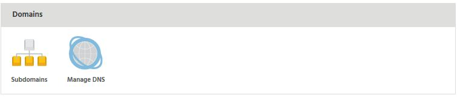
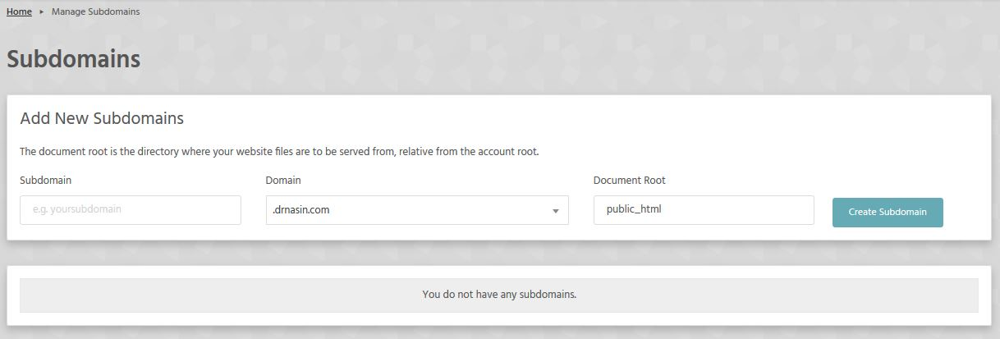

Domains section of StackCP lets you manage subdomains and DNS records for your domain.

### Subdomains
Here you can manage su-domains for your domain.

### Manage DNS

!! It is important you understand the effect of any DNS changes before you make them. For example, an incorrect change to your A, AAAA or CNAME records could break your website.

You can also use our automatic configuration tool for the complete G Suite (formerly Google Apps) or Gmail in just one click.

!!! Please note that changes to your DNS can take up to 24 hours to fully propagate across the internet.

