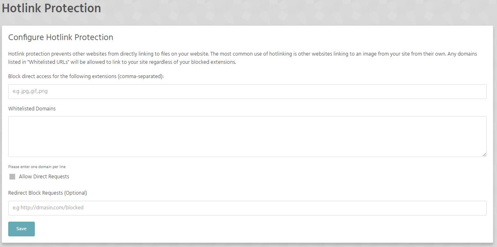

Security Section of Stack Cockpit is reserved for SSH Access, enabling/disabling of SSL and other security related options.

[ui-callout]

[ui-callout-item title="SSH Access" position="42%, 9%, sw"]
Manage keys and configure root access to your hosting package via SSH.
[/ui-callout-item]

[ui-callout-item title="Block Visitors" position="42%, 22%, sw"]
Block visitors by country or IP address.
[/ui-callout-item]

[ui-callout-item title="Hotlink protection" position="42%, 34%, sw"]
Protect your assets (and bandwith) from hot linking.
[/ui-callout-item]

[ui-callout-item title="SSL/TLS" position="42%, 47%, sw"]
Enable/disbale your free SSL certificate or install your own.
[/ui-callout-item]

[ui-callout-item title="Password protection" position="42%, 57%, sw"]
Password protect directories in your web space.
[/ui-callout-item]

[ui-callout-item title="Directory Indexing" position="42%, 69%, sw"]
Directory Indexing controls what happens when a request is made to a directory without a default (index) file. 
[/ui-callout-item]

[/ui-callout]

### SSH Access

See: [SSH Support Section](/ssh)

### Block Visitors
You can block visitors by country or their ip address.

### Hot link protection
Hotlink protection prevents other websites from directly linking to files on your website. The most common use of hotlinking is other websites linking to an image from your site from their own. Any domains listed in "Whitelisted URLs" will be allowed to link to your site regardless of your blocked extensions.

### SSL/TLS
See: [SSL/TLS Support Section](/secure-certificates)

### Password protection
You can protect any directory on your website with basic HTTP Authentication below. When visting a password protected directory, your browser will prompt you for a username and password.
>>>>>> If the directory you would like to protect does not exist yet, it will be created for you.

### Directory Indexing
Directory Indexing controls what happens when a request is made to a directory without a default (index) file. With indexing enabled, a listing of all files inside that directory will be displayed in your browser. If indexing is disabled, a 403 forbidden error is usually shown.

