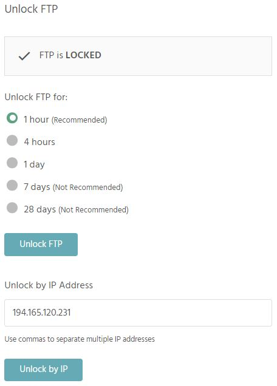
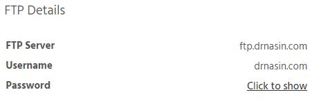

One of the main requirements when creating StackHost.io was not to have open FTP account laying around. We think that the solution we came up is quite brilliant :)

>>>>> FTP Account is locked by default. You have to explicitely enable it here.

>>> This is your MAIN FTP account

Little further bellow you can find information about FTP.

