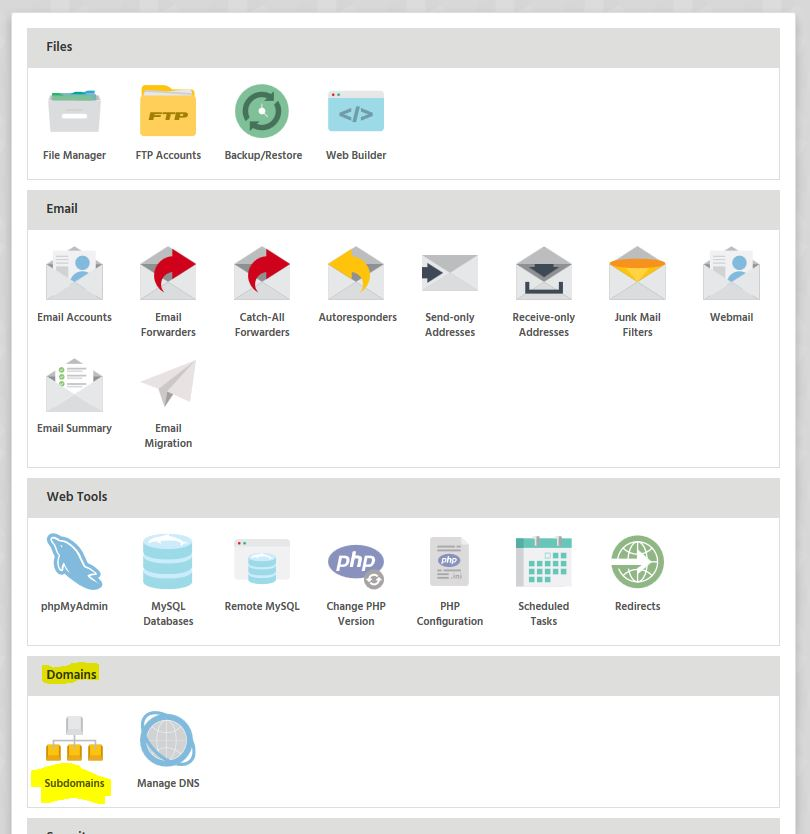
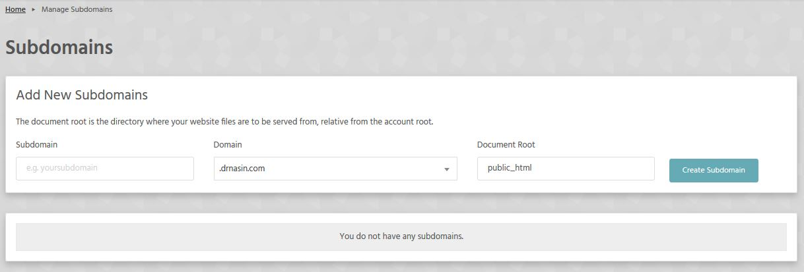

A subdomain can be used in various ways, and it's easy to do via StackCP. A subdomain can used for things like a new website installation, test environment or another area of the site you wish to separate from the main domain (e.g. a gallery section).

To create a subdomain through StackCP you:

* Login to [StackCP](https://stackcp.com)
* Locate the hosting package you wish to add a subdomain to and select Manage
* Select the option called Subdomains which is located under the Domains heading

You can then add your subdomain into the Subdomain box and select "Create Subdomain". You're also able to change the Document Root so that you can direct the subdomain to the folder of your choosing.

! If the subdomain is to be separate from the main site, you can create a folder for it via the File Manager, FTP or SSH.