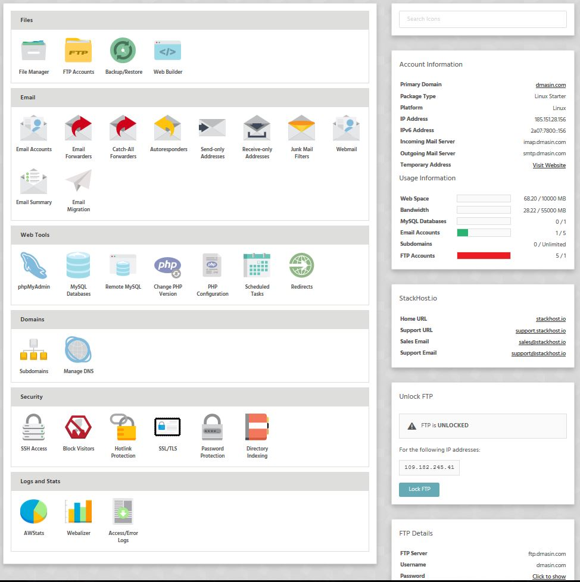

### Stack Cockpit (StackCP)

Tired of old-school, fussy control panels? Stack Cockpit (StackCP) offers a simple and elegant alternative. Manage domains, websites, databases, email accounts, and more from our powerful, modern user interface.

### Created by StackHost devs

Sorry but we just couldn't work anymore with cPanel. It was fine for 2008 but not today. From the start, our team were focused on designing the ultimate web hosting control panel dedicated only to developers.
Decades of experience - combined with customer feedback - gave us that ambition. But it wasn’t easy.

We had to create something new, but not too new! It still had to be familiar enough that an inexperienced web developer would understand it intuitively. We stipped it down to "developers only" features without too many "intelligence insulting" options. 
It also had to be responsive, attractive and cohesive. It needed to be a pleasure to use, not a chore.

We think we were successful. Stack Cockpit has been described as ‘not only beautiful, but fully functional’. It’s easy to navigate, puts everyday tasks right at your fingertips and is supported by a host of reference articles.

Like a successful website, it puts user experience first. Also like the best sites, we’re not leaving it there: based on user data and feedback, we’re working to make it better all the time.

### Stack Cockpit UI
>>>>>> Hover over a number to see a popup with explanation of the section.

[ui-callout]
[ui-callout-item title="Files" position="11%, 3%, se"]
Files section lets you deal with FTP Accounts, site backups/restore actions. Included is a simple File Manager for those "quick" fixes. 
We also found a super awesome web builder (not your usual "bad one"). We use it for simple projects.
[/ui-callout-item]
[ui-callout-item title="Email" position="22%, 3%, se"]
Here you can take care of all the email accounts and actions associated with them (forwarders, autoresponders etc).
[/ui-callout-item]
[ui-callout-item title="Web Tools" position="43%, 3%, se"]
Section where you can CRUD databases, switch PHP version for your account, edit current php configuration, set cron jobs and site redirects.
[/ui-callout-item]
[ui-callout-item title="Domains" position="55%, 3%, se"]
Everything domain related (to change NS please contact your registrar).
[/ui-callout-item]
[ui-callout-item title="Security" position="67%, 3%, se"]
Here you can set up SSH access, enable/diable SSL for your domain, set up various protections (hot linking, visitors blocking...)
[/ui-callout-item]
[ui-callout-item title="Logs and Statistics" position="79%, 3%, se"]
As the name of the section suggests besides error and access logs here you can find the "usual suspect" apps for statistics.
We would use this just as a plan B. Google Analytics is ofc superior.
[/ui-callout-item]
[ui-callout-item title="Account Information" position="17%, 80%, sw"]
We gathered all the account information under one section. If your domain still hasn't propagated you will find here
link to the stagging server.
[/ui-callout-item]
[ui-callout-item title="Usage Information" position="34%, 79%, sw"]
Statistics regarding web usage, email accounts, ftp accounts etc.
[/ui-callout-item]
[ui-callout-item title="FTP Access" position="66%, 75%, sw"]
Here you can enable/disable FTP access. We think this to be our best solution regarding FTP security.

! [color=orange] FTP accounts are locked by default![/color]
[/ui-callout-item]
[ui-callout-item title="FTP Details" position="87%, 75%, sw"]
This is your "main" FTP account and it's details.
[/ui-callout-item]
[ui-browser address="https://stackcp.com"]

[/ui-browser]

[/ui-callout]

