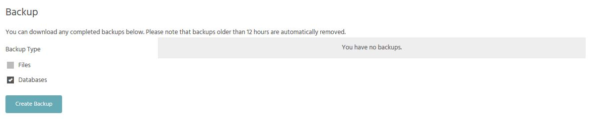
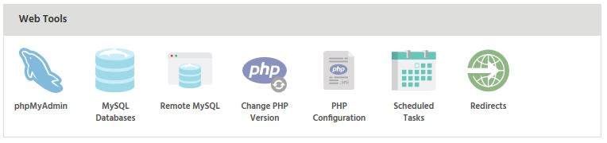

There are various ways to export your MySQL databases for safe keeping or transfer. The first method allows you to backup multiple databases via your StackCockpit (StackCP) control panel and the second on a 'per database' basis via phpMyAdmin.

### Using Backup/Restore in Stack Cockpit

**Stack Cockpit** provides an easy way to download all databases associated with your hosting package. To access this page:

- Access the Backup/Restore page under **Files**

- Ensure 'Databases' is checked under 'Backup Type'
- Click 'Create Backup'

A backup task will then be queued by our system. Once finished, a download link will be provided; this usually takes 1-2 minutes, dependent on the size of the database. You can then download a zip file containing all your MySQL databases.

### phpMyAdmin

The phpMyAdmin management software lets you import and export your databases. 

- Login to your database via phpMyAdmin (under Web Tools)

- Choose the database you want to backup down the left hand side
- Click the 'Export' tab at the top of your page
- Leave 'Quick' selected under 'Export Method'
- Select your desired format - we recommend "SQL" for most cases
- Click "Go"

Within a few seconds a download should begin in your browser.

Here is a nice video tutorial on how to do just that.

[plugin:youtube](https://www.youtube.com/watch?v=MEpM6fuD4yM)