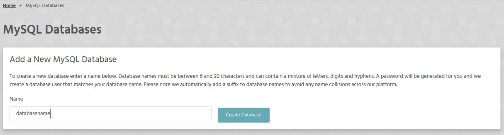
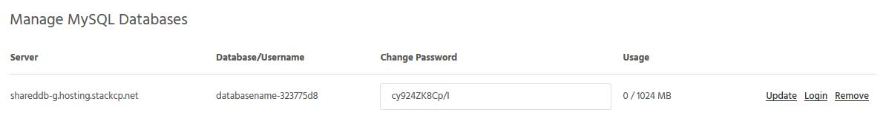

You can create MySQL databases in seconds directly from your [StackCP](https://stackcp.com) control panel. 

>>>> This option is unavailable for packages hosted on our WordPress platform due to its WP-optimised nature.

Starter Hosting packages are limited to one MySQL database. For more databases, you can upgrade your hosting package, or purchase an additional hosting plan.
To create new MySQL databases:

1. Log in to StackCP and select 'Manage Hosting'.
3. Under 'Web Tools’, select 'MySQL Databases'. 

Here you can complete the following actions:

* Create new MySQL databases. Each MySQL database has a maximum size of 1024MB (1GB).
* Manage existing databases.
* Add additional MySQL users to databases.
* Manage your additional MySQL users.

4. Under 'Add a new MySQL Database', choose a name for your database. Database names must be between 6 and 20 characters long, and we automatically add a suffix to avoid name collisions with other users.

5. Once you have chosen a name, click 'Create Database'. Your new MySQL database will automatically appear in the 'Manage MySQL Databases' section underneath.

From here you can change the automatically generated password, monitor usage, remove your MySQL database, or log in to your database.