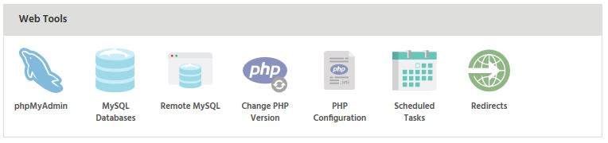
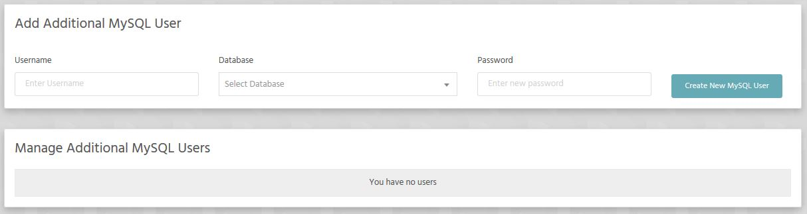

Here is how to manage users for your database(s).

* Log into [Stack Cockpit](https://stackcp.com)
* Under **Web Tools** select **MySQL Databases**

* At the bottom of the page you have 2 tabs reserved just for that. It's pretty much self explanatory.

