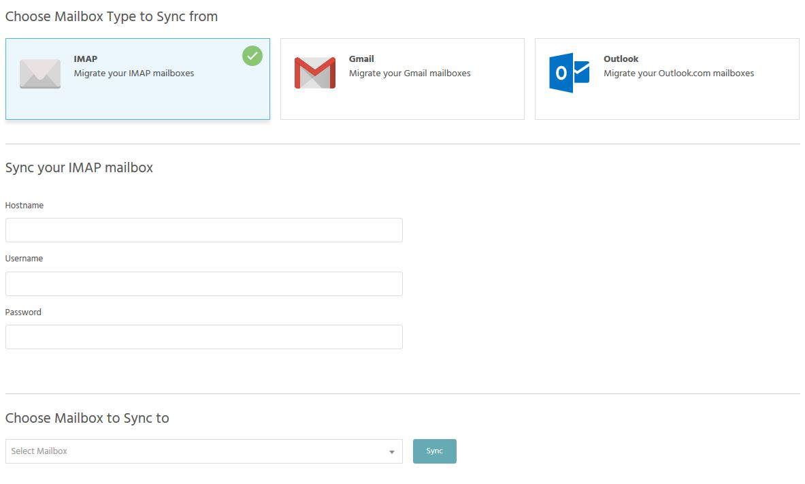

To migrate your emails and mailboxes to StackHost, you can use our in-house Email Migrations tool. This will let you migrate your IMAP mailboxes, your Gmail mailboxes and your Outlook mailboxes into StackHost.

To do this: 

- Login to [StackCockpit](https://stackcp.com)
- Select which package you want to migrate emails into via Manage Hosting.
- Select the Email Migrations tool that is within the emails section. 

[ui-callout]

[ui-callout-item title="Email Migration" position="60%, 23%, sw"]
Use this tool to migrate your emails from various providers.
[/ui-callout-item]

[/ui-callout]

- You can now simply enter the relevant credentials and select then select 'Sync'.

>>>>> You will need to have set up the mailboxes within StackHost first using the same password as currently used by the mailbox.

!! If your sync fails to start, this is likely due to the credentials not being correct. You should confirm that the password you have used is correct and that the hostname is also correct.