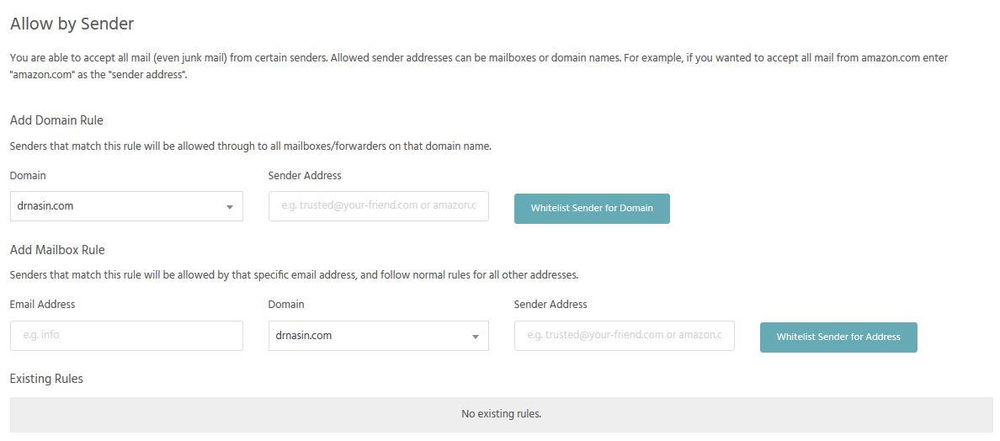

If you want to allow all emails to be received from a specific sending email address - so that even mails classed as 'junk' will arrive - then you can 'whitelist' this address within Junk Mail Filters within the package. 

- Login to [StackCP](http://stackcp.com)
- Select domain where your mailboxes are located 
- Under **Email** tab click "**Junk Mail Fiters**"

[ui-callout]

[ui-callout-item title="Junk Mail Filters" position="30%, 82%, sw"]
Here you can configure junk mail filters for email addresses.
[/ui-callout-item]

[/ui-callout]

- At the bottom of the page locate 'Allow by Sender' and add a domain rule or a mailbox rule to allow mail to always be recieved from a specific address

