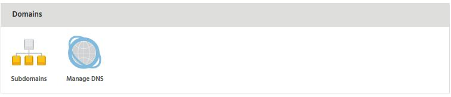

**SRV records** - service records used in Office 365 - can be added via our DNS Management interface inside the StackCP.

You can reach this interface via the StackCP -> Manage Hosting -> Select Package -> Manage DNS section under **Domains** tab

Towards the bottom of the Manage DNS page you will see 3 inputs to allow you to add new records. 

To add one:

- Select **SRV** from the Type dropdown.
- In the Name field, type: **\_sip.\_tls**
- In the Data field, type: **sipdir.online.lync.com**
- Enter **100** for **Priority**.
- Enter **1** for **Weight**.
- Enter **443** as the **Port**.

For the second record, select Click to add another record. A new row will appear.

- Select **SRV** from the Type dropdown.
- In the Name field, type: **\_sipfederationtls.\_tcp**
- In the Data field, type: **sipfed.online.lync.com**
- Enter **100** for **Priority**.
- Enter **1** for **Weight**.
- Enter **5061** as the **Port**.

Remember to save the records by clicking **'Update DNS'**.

#### That's it!

Your SRV records are now added. Our nameservers will start answering with them almost instantly - but may take up to 2 minutes. If you're running through the Microsoft setup wizard or DNS checker you will be able to continue shortly.
 
>>>>> The above SRV records are correct as of 26th Feburary 2017, but we recommend checking your Microsoft account for any changes.