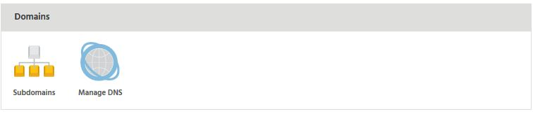
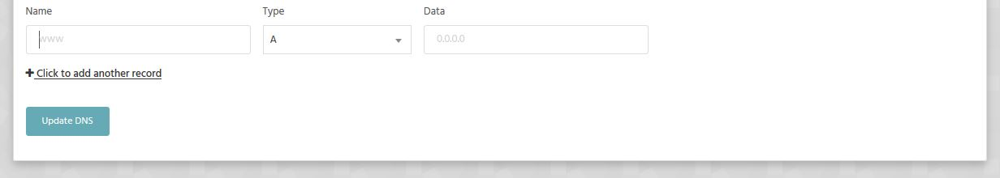

[Sender Policy Framework](https://support.google.com/a/answer/33786?hl=en) (SPF) records help reduce the chance of your domain being spoofed in spam messages. It can also increase the deliverability of e-mail to external providers such as Gmail and Outlook.

We maintain an SPF record that is kept up to date with all IP addresses used to transmit e-mail from our network. This ensures that any e-mail sent from our services passes an SPF check. To use this on your domain, you need to add a TXT record in DNS.

Firstly, access the DNS Management interface for your name. If the domain is registered with us, you can access this from the 'Manage Domains' area of the control panel. If the domain is not with us but is assigned to a hosting package, you can reach this interface via the Manage Hosting -> Select Package -> Manage DNS section.

Towards the bottom of the Manage DNS page you will see 3 inputs to allow you to add new records. 

To add it:

- Leave the '**Name**' field blank
- Select '**TXT**' for Type
- Enter **v=spf1 include:spf.stackmail.com a mx -all** as data

Then save the changes. Your domain is now protected by an SPF record. 

You can use the same record for all domains that use our mail services, however it should be noted that the above record will tell external providers all of your e-mail should originate from our network. If this isn't the case the record should be updated accordingly. 