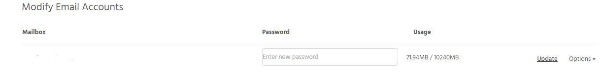

Changing passwords for any mailbox can be done through the [StackCP](https://stackcp.com) control panel.

- Log in to [StackCP](https://stackcp.com) and select 'Manage Hosting'.
- Select 'Manage' on the hosting package that contains the mailbox you wish to change the password on.
- Choose 'Email Accounts' under 'Email'.

[ui-callout]

[ui-callout-item title="Email Accounts" position="30%, 10%, sw"]
Create and edit your email accounts here. Package limits apply.
[/ui-callout-item]

[/ui-callout]

- Simply locate your mailbox and enter a new password and click "Update". Your new password will have been successfully saved. 

! You will not be able to recover your old password for the mailbox. We do this to increase your security.