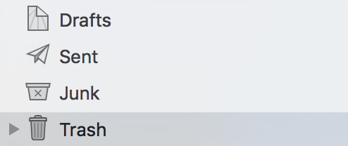
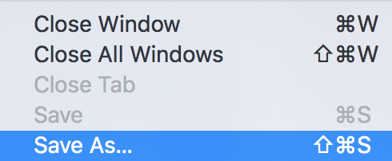

With StackHost all mailboxes have 10 GB of data storage. It's unlikely that you should ever fill this unless you're receiving a lot of spam, or have a lot of emails with large attachments.

All the emails and attachments you have in your mailbox are stored on a server, and each mailbox is given a specified amount of space on the server, 10 GB in the case of StackHost. Once that space has been filled by email and data, you will no longer be able to receive emails.

To check your mailbox usage:

- Log in to Stack CP and go to 'Email Accounts'.
- Locate your mailbox and the usage will be displayed next to it.  

To resolve this issue there a few options:

* **Empty your trash within your mail client.** When you delete emails from your inbox they go into the trash folder which means they are still taking up space on the server. Make sure there are no emails that you may need from the trash folder because to clear them from the server will mean permanently deleting them. Usually, you can right click on the trash folder on select an option such as 'Erase Deleted Items' or 'Empty Trash'. There are also settings in some mail clients that will automatically delete items when you send them to the trash, but if you accidentally delete an email it will be gone permanently.

* **Create a backup of your emails.** One way to free up space on the server is to create a backup of your emails on local storage such as your hard drive, and then deleting them within your mail client. To do this you should be able to select the emails you want to save then go to File > Save as... and select the local area you want to save the emails to. 

* **Clear your sent messages.** Similiar to messages stored in the Trash folder, sent items will still remain on the server. Deleting your sent items will not mean they are deleted from the recipients mailbox, just the mailbox they were sent from. You can either go into the Sent Items folder and choose which emails you wish to delete, or you can right-click and select "Delete".