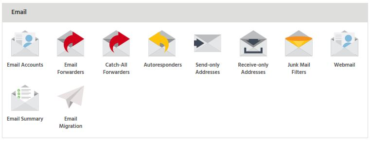
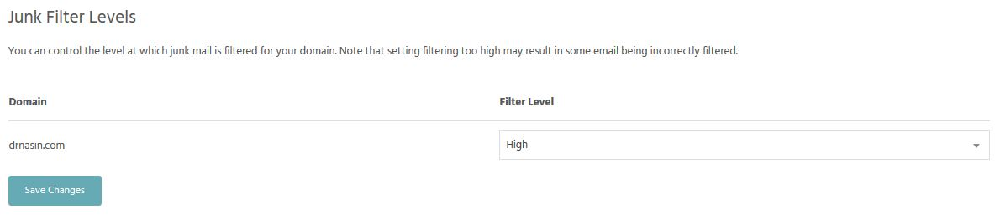
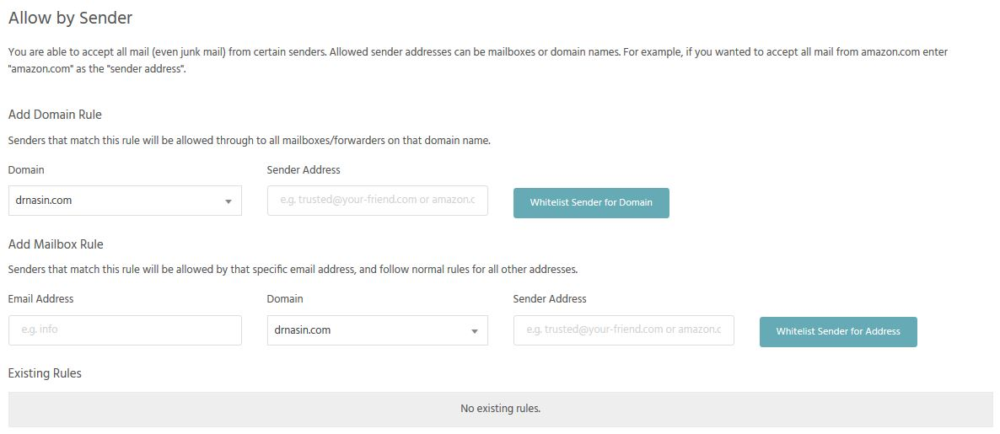

The primary reason for mail not being forwarded is if it is being classed as spam. If an email has been classified as spam, it may get received by one email address but then not forwarded on to the subsequent email address. This helps the reputation of the server and prevents blacklisting.

To resolve this, you can try lowering the spam filter via ‘Junk Filters’ withing StackCP.

To do this:

* Login to Stack Cockpit
* Locate the package containing the forwarder and select ‘Junk Filters’

* You could also try whitelisting the domain/email address the email is coming from.

