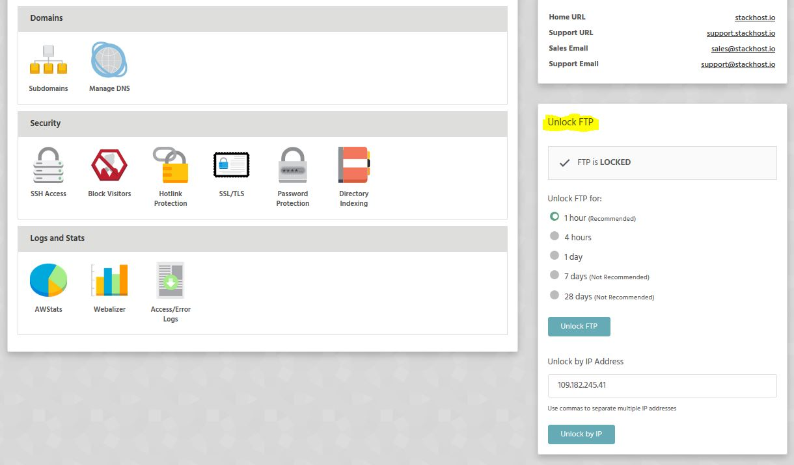

There are a couple of common causes for not being able to connect to FTP:

### Nameservers

You need to make sure the domain is using our nameservers. These are:

|Stackhost.io nameservers|
|-|
|`ns1.stackdns.com`|
|`ns2.stackdns.com`|
|`ns3.stackdns.com`|
|`ns4.stackdns.com`|

### Unlock FTP

You will need to unlock FTP to access it. To do this:

* Login to StackCP
* Select the hosting package you want to unlock FTP for
* You can then select to unlock FTP by time, or by a specific IP address.

### Nameserver Propagation

If you've just purchased a domain name or switched nameservers then it could take up to 24 hours for the nameservers to fully propogate.

If you need access to FTP during this time you can use the host name

	ftp.stackcp.com
    
for Linux and Windows packages, or 

	wordpressftp.stackcp.com
    
for WordPress packages.