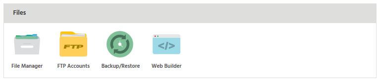
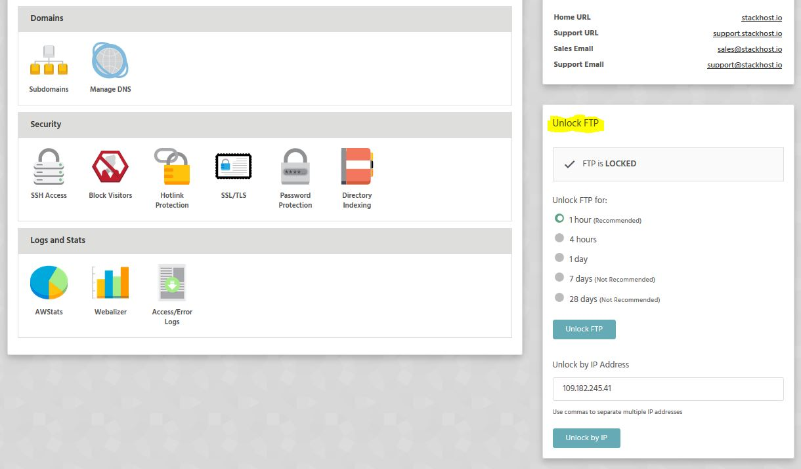

Everything you need to know about FTP.

### Stack Cockpit
Login to **StackCP** and click on **Manage**
Locate **Files** tab. Should be pretty easy as it's the first one :)
Click on **FTP Accounts**

[ui-callout]

[ui-callout-item title="FTP Accounts" position="42%, 23%, sw"]
Create/edit/delete FTP Accounts. _Account limits apply_.
! FTP Accounts are locked by default
[/ui-callout-item]

[/ui-callout]

!!!! **Important**: FTP IS LOCKED BY DEFAULT! You have to explicitly enable it in your StackCP!

To enable FTP please check the FTP section of your StackCP. You have few options of enabling the FTP. We found this to be the most secure option. You're welcome :)

