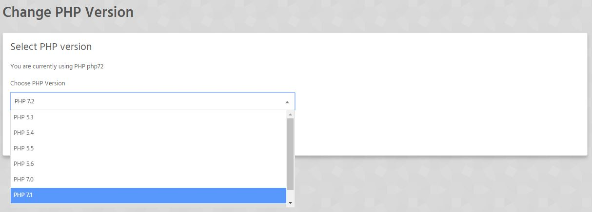

As standard, we run PHP 7.0. If you wish to switch this version, head to StackCP > Manage Hosting > "Change PHP Version"

Change PHP version.

Our Linux platform has the ability to run 7 different versions of PHP:

- PHP 5.3
- PHP 5.4
- PHP 5.5
- PHP 5.6
- PHP 7.0
- PHP 7.1
- PHP 7.2

!!!! Version changes may take up to 60 seconds, but are usually instant. 

! On our Managed WordPress Platform we run PHP 7.0 and this cannot be changed.