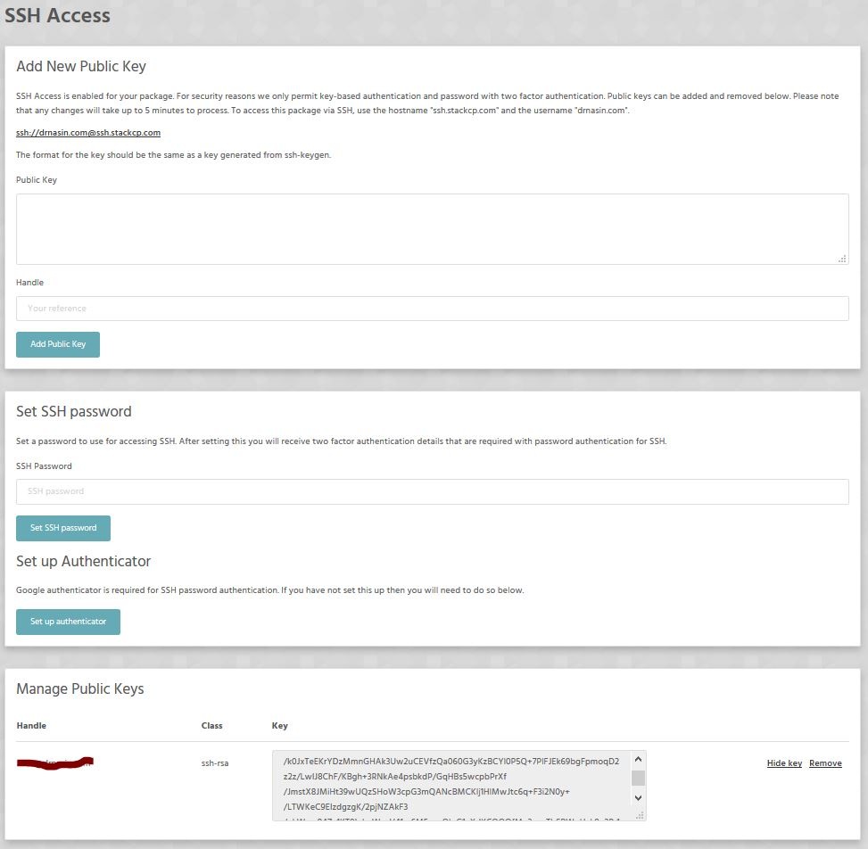

As web developers it is hard to work these days without SSH access to servers. Not impossible. Just harder. By using SSH you could make your life as a developer much easier.

>>>> Please use SSH only if you know what you're you doing.

To access SSH settings please login to StackCP -> click Manage and locate Security tab.

After clicking SSH Access you will see a panel like this.We advise you to ignore **Set SSH password** and **Set up Authenticator**. These are extremely advanced features. Even we don't use them...

