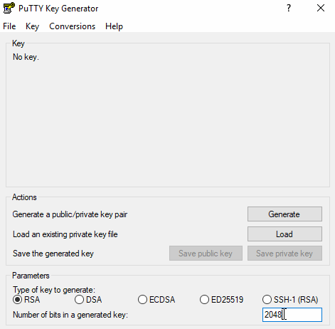
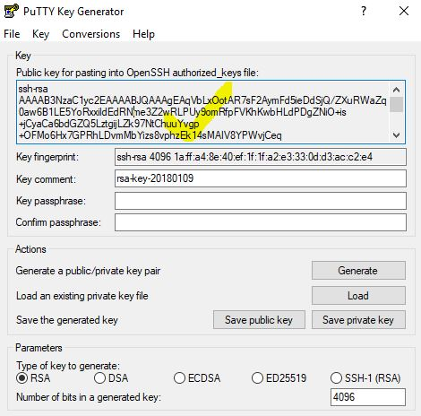
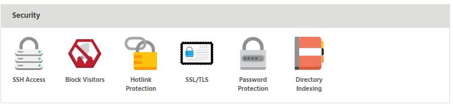
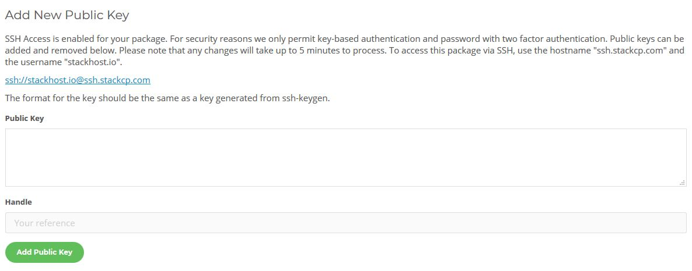
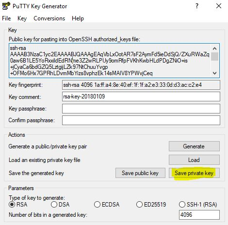
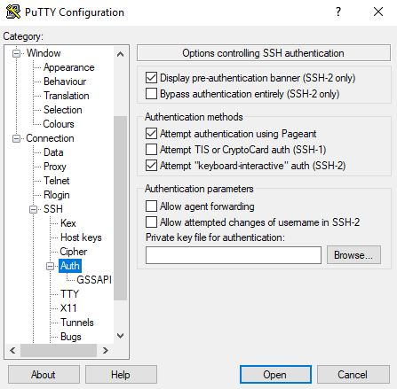
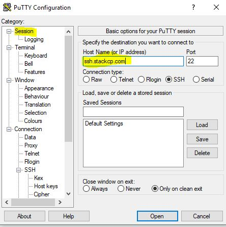
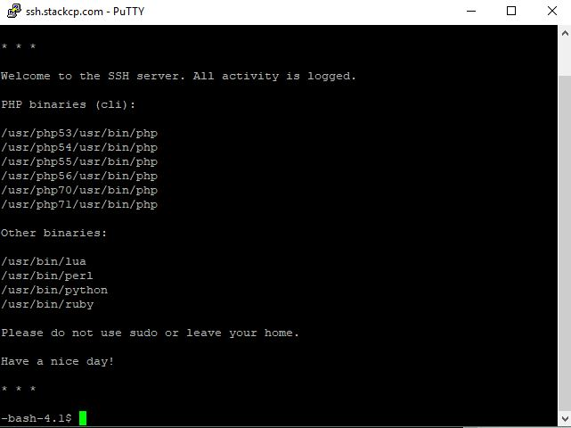

>>>> It is only recommended that you connect to your package via SSH if you're familiar with the command line interface.

### Windows

If you're using Windows, you'll need to download an SSH Client to access SSH.

This guide uses PuTTY which is a free SSH client and can be [downloaded here](https://www.chiark.greenend.org.uk/~sgtatham/putty/latest.html).

>>>>> You will be using 2 apps. `PuTTY Key Generator` for generating keys and `Putty` itself for the command line access.

1. Once you have downloaded PuTTY, search for and open `PuTTY Key Generator` on your computer.

! `Optional security step` Before generating the key change the value of "Number of bits in generated key" to `4096`

2. Select ‘Generate’ and move the mouse around in the gray box to generate some ‘Randomness’. This will generate a **public key**. Copy content of the textbox (public key) to clipboard.

! **OPTIONAL STEP **- Add a **key passphrase** (password). This is what you'll need to put into the command line interface when loging in. Otherwise leave it empty for no password (you'll be basically using private key file with no password so make sure private key is kept safe.)

3. Login to [StackCP](https://stackcp.com), head to ‘Manage Hosting’ and select the package that you want SSH access for. Then select, ‘SSH Access’ from under the ‘Security’ section.

[ui-callout]

[ui-callout-item title="SSH Access" position="42%, 9%, sw"]
Manage keys and configure root access to your hosting package via SSH.
[/ui-callout-item]

[/ui-callout]

4. Then input the **public key**  that was generated from PuTTYgen into the **‘Public Key’** box (should be in your clipboard from step 2). A handle will be generated automatically. Then select **‘Add Public Key’**.

5. Head back to PuTTY Gen and select **Save private key**. Save this as any name you want.

6. Ok, this time open **PuTTY** (not PuTTYGen). Down the left-hand side, select to expand the ‘SSH’ menu and then select ‘Auth’.

7. Select ‘Browse’ and add the **private key** you have just saved.
8. Head back to ‘Session’ using the left-hand menu and add the host name ‘ssh.stackcp.com’ and select ‘open’

>>>>>> Save your session for next time so you don't have to repeat steps 7, 8 and 9 every time you want to connect

9. The command line interface will be show. Then login with your domain (e.g. example.com).
10. If you didn't skip step 3 you will be asked for password. Enter it.
11. You'll now have access to SSH for your site.

