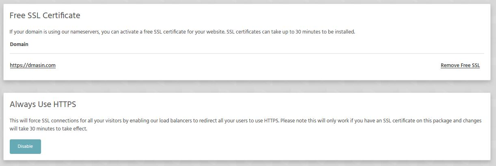

Each and every domain hosted on our servers has the option of having a free SSL certificate which you can install with one click.

Here is how to do it:

* Log in to StackCP -> (domain name) -> Manage
* Navigate to **Security** tab and click on **SSL/TLS**

[ui-callout]

[ui-callout-item title="SSL/TLS" position="42%, 47%, sw"]
Enable/disbale your free SSL certificate or install your own.
[/ui-callout-item]

[/ui-callout]

Here you can enable/disable your free ssl for domain (and subdomains). Installation will take up to 30 mins.
You can also enable **Force SSL** for a specific domain (subdomain).

>>> Please allow up to 30 minutes for the certificate to be deployed to our load balancers.