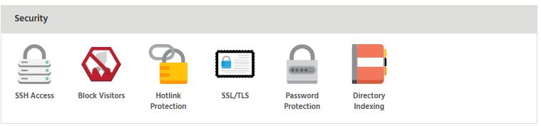
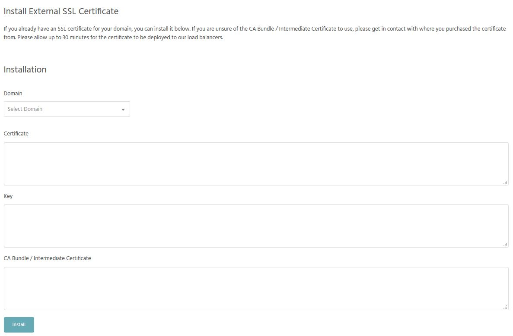

### Installing custom SSL certificate

To install your custom SSL vertificate head over to [StackCP](https://stackcp.com) and log in. Click **Manage** besides your domain.

Locate **Security** tab and click on **SSL/TLS**.

[ui-callout]

[ui-callout-item title="SSL/TLS" position="42%, 47%, sw"]
Enable/disbale your free SSL certificate or install your own.
[/ui-callout-item]

[/ui-callout]

Towards the end of the page you'll see the **Install External SSL Certificate** form.

Enter the details and you're ready to go.

>>> Please allow up to 30 minutes for the certificate to be deployed to our load balancers.
