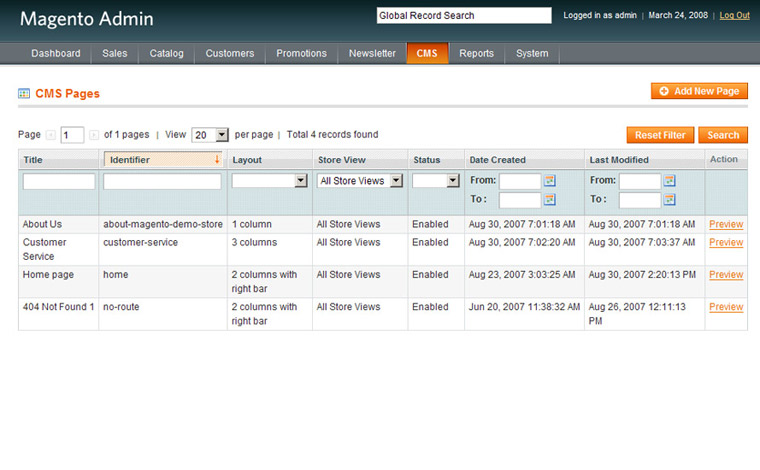

!!! If you have to ask this question then maybe our service is not for you. **StackHost.io** is "developers only" hosting provider.

But for the sake of learning here are a few facts about **Magento** or as we call it **Magneto** :)

Magento is an ecommerce platform built on open source technology which provides online merchants with a flexible shopping cart system.
Users can control the look, content and functionality of their online store. Magento offers powerful marketing, search engine optimization, and catalogue-management tools.

