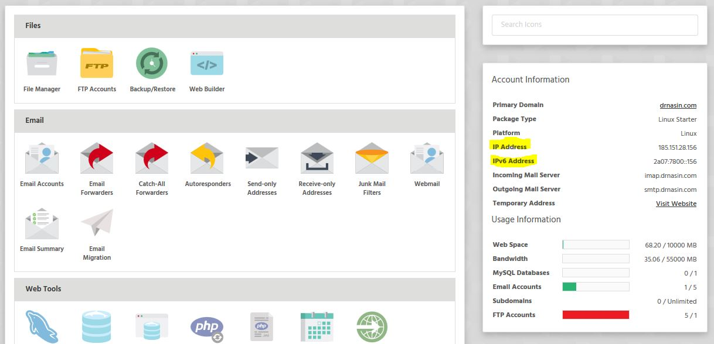

If you're managing DNS elsewhere, or simply wish to know the IP address of a package, you can find this within your hosting control panel. 

- Firstly you'll need to head to 'Manage Services' and select 'Log in' for the package you wish to check.
- On the right, under the header 'Account Information', the IPV4 and IPV6 addresses for the package will be displayed.

>>> The IPV4 and IPV6 addresses can be used simultaneously, or you can use one without the other - depending on which protocol is supported within the interface you're using.