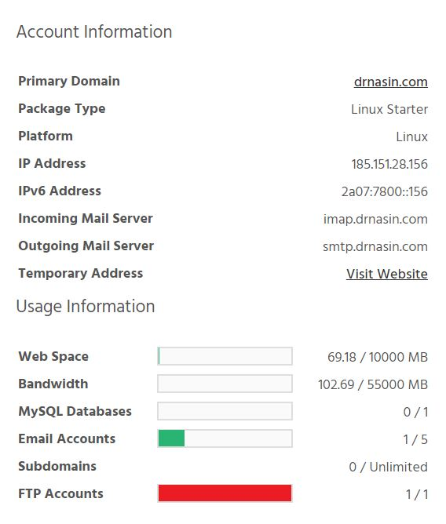

When you create a hosting package you're given a temporary URL, as below.

[ui-callout][ui-callout-item title="Temporary URL" position="54%, 75%, ne"] Here you can see your temporary address.[/ui-callout-item][/ui-callout]

There are a few reasons why you may want to use the temporary URL.

### Viewing a hosting package when you have used a domain reference

At StackHost.io you can create a hosting package using a domain reference. This means that the hosting package won’t be 
connecting to a live domain name via DNS, so to view the files you’ve uploaded to the site you can use the temporary URL.
It will display the site as if it were live, except it will be on our temporary URL servers and the URL is something like 

    http://example-com.stackstaging.com

### Viewing a site that you’ve migrated, before you switch the DNS to StackHost.io

When migrating a site to StackHost.io, we recommend the following process:

1. Migrate the site files, emails and databases to StackHost.io
2. Check the site works at StackHost.io via the temporary URL
3. Point the nameservers to StackHost.io.

>>>>> Step 2 is where the temporary URL comes in. After you’ve copied all the site data in StackHost.io, you may want to check that it works. Selecting the temporary URL will show you what the site will look like before you’ve pointed the nameservers to StackHost.io’s.

### Showing your client their site before making it live on the actual domain name

You may want to show your client a site that you’ve developed for them, without it being accessible on the live domain name. You can give your clients the URL:

    http://example-com.stackstaging.com

!!!! Alternatively, you create a redirect from the domain name to the temporary URL. We have a guide on how to switch between 
!!!! using the temporary URL and live one: [How do I take my temporary test site / StackStaging site live?](/web-hosting/how-do-i-take-my-temporary-test-site-stackstaging-site-live)

### Frequently Asked Questions

##### Is the temporary URL the same as a Staging Environment?

No, the temporary URL is not the same as a staging environment as it will always reflect what will be on the live site, so it’s not possible to perform work and then “push” changes to the live domain name.

##### Does the temporary URL support SSL?

The temporary URL does not support SSL, so if you have a hard-coded redirect that forces http:// -> https:// this will need to be removed. Similarly, when you are switching between the live domain and temporary URL, you need to make sure you add http and not https.

##### Are there any alternatives to using the temporary URL?

Yes, you can modify your hosts files. Your machine's local hosts file allows you to override DNS for a particular domain or subdomain name. 
This is a great way to test the site ahead of changing real DNS: you're able to test the website at StackHost.io while the 
rest of the internet continues to use DNS to point to the existing website. We have a full guide about this here: 

[How can I modify my hosts file?](/web-hosting/how-can-i-modify-my-hosts-file)

##### Does my website perform the same on the temporary URL servers?

No, temporary URL servers are reduced capacity as they're just for trialing a website on the platform before going live so
they're not intended to benchmark performance.

