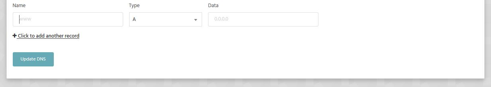

There are two possible variations on how to approach this, dependent on whether the site in development is hosted elsewhere or whether you're creating a WordPress site on StackHost.io:

### Developing your site at StackHost.io but it is hosted elsewhere

You may be using the temporary URL within StackCP whilst you develop your site. To take the site live you'll need to do either of the following:

##### You can either point the domain to our nameservers which are

|Nameservers|
|-|
|`ns1.stackdns.com`|
|`ns2.stackdns.com`|
|`ns3.stackdns.com`|
|`ns4.stackdns.com`|

or

##### Point the domain to the A Record that is located within StackCP > Manage DNS. 

### WordPress Sites

If you are using the temporary URL within StackCP and you have a WordPress site, you may need to do either, or both of the following:

Update the temporary URL within WordPress Admin: 

- Log in to the WordPress admin.
- Click on Settings on the left hand side.
- Change the WordPress Address (URL) to your actual domain name.
- Change the Site Address (URL) to your actual domain name.
- Update the database.
- Backup your database and save the copy off-site.

And/or:

- Login to phpMyAdmin.
- Select the link to your database and choose the one that is your WordPress database.
- All the tables in your database will appear on the screen. You will then see all the tables in your database, locate wp_options and select Browse.
- A screen will open with a list of the fields within the wp_options table. Under the field option_name, locate 'siteurl'.
- Click the Edit Field icon which usually is found at the far left at the beginning of the row.
- The Edit Field window will appear.
- In the input box for option_value, change the URL information to the new site address.
- Verify this is correct and click Go to save the information. You should be returned to your wp_options table.
- Look for the home field in the table and click Edit Field. Note: there are several pages of tables inside wp_options. Look for the > symbol to page through them.
- In the input box for option_value, carefully change the URL information to the new address.
- Verify this is correct and select 'Go' to save the information.

>>>>> There is further information about this here: [https://codex.wordpress.org/Changing_The_Site_URL](https://codex.wordpress.org/Changing_The_Site_URL)